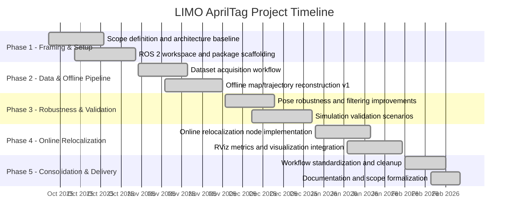

# Project Roadmap (Oct 2025 - Feb 2026)

## 1. Objective

This roadmap defines the project progression from initial setup to final delivery for the AprilTag-based trajectory learning and relocalization workflow.

Project duration:
- **Start:** October 2025
- **End:** February 2026

---

## 2. Timeline (Visual)

---

## 3. Milestones

| Milestone | Date | Result |
|---|---|---|
| M1 - Baseline Established | Oct 2025 | Workspace and architecture baseline prepared |
| M2 - Offline Pipeline Ready | Nov 2025 | Initial map/trajectory extraction available |
| M3 - Validation Strengthened | Dec 2025 | Robustness and simulation validation improved |
| M4 - Online Metrics Operational | Jan 2026 | Live distance/heading relocalization outputs |
| M5 - Final Delivery | Feb 2026 | Standardized workflows and formal documentation |

---

## 4. Deliverables by End Date

- Offline reconstruction pipeline for trajectory and tag maps.
- Offline comparison/evaluation pipeline.
- Online relocalization node with ROS topic outputs.
- RViz visualization for current pose, nearest pose, reference path, and markers.
- Structured real and simulation profile scripts.
- Scope and requirements documentation.

---

## 5. Scope Boundary Reminder

This roadmap covers AprilTag-based trajectory learning and relocalization workflows. It does not include full global navigation, SLAM in unknown worlds, or dynamic obstacle avoidance.
